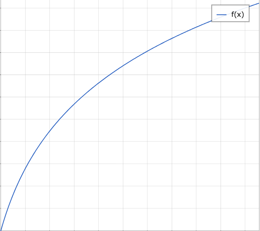

# teensy audio multipressor
a multi-band audio ~~compression~~ waveshaper to reduce dynamic range by applying a log curve (below) to the input signal

Please dont take this too seriously - its really just a crazy experiment. I'd like to see how well it works for sided-chain ~~compression~~ "wave-shaping". 

## effect_compressor
* f(x) = log10((9 * x)+1) where 0 < x < 1



* http://mathnotepad.com/
```
f(x) = log((9 * x)+1, 10)
plot( f(x) )
```
